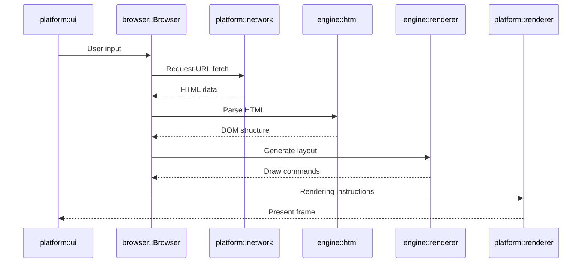

# Orinium Browser Architecture

## 1. Overall structure
```
User Input
   │
   ▼
platform::ui (App)
   │ event
   ▼
browser::Browser
   │ fetch(url)
   ▼
platform::network::NetworkCore
   │ HTML bytes
   ▼
engine::html::parser
   │ DOM Tree
   ▼
engine::renderer
   │ Vec<DrawCommand>
   ▼
platform::renderer
   │ GPU submission
   ▼
Window Frame
```

## 2. Responsibilities of each layer
| Layer                  | Main modules                       | Role                                                                                |
|------------------------|------------------------------------|-------------------------------------------------------------------------------------|
| **Application**        | `examples/tests.rs`, `main.rs`     | Tests, startup logic, and CLI entrypoint.                                           |
| **browser**            | `src/browser/mod.rs`               | Orchestration layer that integrates the system and controls startup/initialization. |
| **platform::ui**       | `src/platform/ui`                  | Manages OS windows and the event loop (`winit`); the outer boundary of the app.     |
| **platform::renderer** | `src/platform/renderer`            | GPU abstraction (wgpu-based). Executes draw commands and manages frames.            |
| **engine::renderer**   | `src/engine/renderer`              | Logical rendering layer that converts HTML/CSS layout results into draw commands.   |
| **engine::html / css** | `src/engine/html`・`src/engine/css` | Tokenization, parsing, and construction of the DOM/CSSOM.                           |
| **platform::network**  | `src/platform/network`             | TCP/TLS networking, HTTP handling, cache and cookie management.                     |
| **platform::io**       | `src/platform/io`                  | OS-dependent I/O abstractions (files, configuration, etc.).                         |

## 3. Simple execution flow


## 4. Dependency direction and inversion
* Module dependencies should be strictly one-way: top → bottom.
* Lower layers must not reference higher layers.
* Inversion of dependencies should be avoided as it can introduce cyclic dependencies.
> [!NOTE]
> The `engine` layer must not reference the `platform` layer.

### Dependency direction diagram

```
┌───────────────┐
│    browser    │
└───────┬───────┘
        ▼
┌───────────────┐
│ engine        │
│ renderer/html │
└───────┬───────┘
        ▼
┌───────────────┐
│ platform      │
│ renderer/ui   │
└───────────────┘
```
* Arrows indicate dependency direction.
* Only the upper layer calls the lower layer in a single direction.

<!--
Events propagate from higher layers to lower layers. Lower layers should not reference higher layers; use callbacks or channels when necessary.
-->
