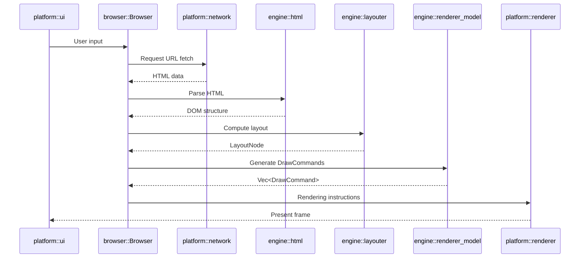

# Orinium Browser Architecture

## 1. Overall structure
```
User Input
   │
   ▼
platform::ui (App)
   │ event
   ▼
browser::Browser
   │ fetch(url)
   ▼
platform::network::NetworkCore
   │ HTML bytes
   ▼
engine::html::parser
   │ DOM Tree
   ▼
engine::layouter
   │ Vec<DrawCommand>
   ▼
platform::renderer
   │ GPU submission
   ▼
Window Frame
```

## 2. Responsibilities of each layer
| Layer                      | Main modules                                                             | Role                                                                                                   |
|----------------------------|--------------------------------------------------------------------------|--------------------------------------------------------------------------------------------------------|
| **Application**            | `main.rs`, `examples/tests.rs`                                           | Entry point, CLI, and process management (`ProcessHandler`).                                              |
| **browser::core**          | `src/browser/core/` {`app`, `tab`, `command`, `ui/`, `webview/`, `resource_loader`} | Orchestration layer that integrates the system: app startup, tab management, UI composition.           |
| **engine::html / css**     | `src/engine/html/`・`src/engine/css/`                                     | Tokenization, parsing, and construction of the DOM/CSSOM.                                              |
| **engine::layouter**       | `src/engine/layouter/` {`builder`, `css_resolver`, `text_layouter`, `types`} | Layout computation from HTML/CSS; produces InfoNode/LayoutNode trees.                                  |
| **engine::renderer_model** | `src/engine/renderer_model/` {`draw_command`}                             | Logical rendering layer that converts DOM+CSS into `DrawCommand` values.                                |
| **engine::bridge / input / tree / ui** | `src/engine/bridge/`, `input/`, `tree/`, `ui/`                           | Event bridging, input abstraction, tree structures, UI components.                                     |
| **platform::renderer**     | `src/platform/renderer/` {`gpu`, `glyph/`, `text/`, `image`, `scroll_bar`, `text_measurer`} | GPU abstraction (wgpu-based). Actual rendering, font atlases, texture upload, scroll bar rendering.   |
| **platform::network**      | `src/platform/network/`                                                  | TCP/TLS networking, HTTP handling, cache and cookie management (runs in a separate process).             |
| **platform::system**       | `src/platform/system/`                                                   | OS window management and event loop (`winit`).                                                              |
| **platform::io**           | `src/platform/io/`                                                       | OS-dependent I/O abstractions (files, configuration, etc.).                                             |
| **platform::audio**        | `src/platform/audio/`                                                    | Audio playback (`cpal` / `symphonia`-based).                                                            |

## 3. Simple execution flow

```mermaid
sequenceDiagram
    participant UI as platform::ui
    participant Browser as browser::Browser
    participant Net as platform::network
    participant HTML as engine::html
    participant Layout as engine::layouter
    participant Draw as engine::renderer_model
    participant GPU as platform::renderer

    UI->>Browser: User input
    Browser->>Net: Request URL fetch
    Net-->>Browser: HTML data
    Browser->>HTML: Parse HTML
    HTML-->>Browser: DOM structure
    Browser->>Layout: Compute layout
    Layout-->>Browser: LayoutNode
    Browser->>Draw: Generate DrawCommands
    Draw-->>Browser: Vec<DrawCommand>
    Browser->>GPU: Rendering instructions
    GPU-->>UI: Present frame
```

## 4. Dependency direction and inversion
* Module dependencies should be strictly one-way: top → bottom.
* Lower layers must not reference higher layers.
* Inversion of dependencies should be avoided as it can introduce cyclic dependencies.
> [!NOTE]
> The `engine` layer must not reference the `platform` layer.

### Dependency direction diagram

```
┌─────────────────────┐
│ browser::core       │
│ (app, tab, command) │
└──────────┬──────────┘
           ▼
┌─────────────────────┐
│ engine              │
│ (html, css, layouter,│
│  renderer_model     │
│  tree, input, ui)   │
└──────────┬──────────┘
           ▼
┌─────────────────────┐
│ platform            │
│ (renderer, network, │
│  system, io, audio) │
└─────────────────────┘
```
* Arrows indicate dependency direction.
* Only the upper layer calls the lower layer in a single direction.
* `engine` does NOT depend on `platform`; it only depends on external crates and Rust std.

<!--
Events propagate from higher layers to lower layers. Lower layers should not reference higher layers; use callbacks or channels when necessary.
-->
