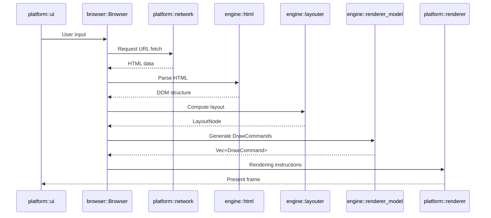

# Orinium Browser Architecture

## 1. Overall structure

```
User Input
   │
   ▼
platform::ui (App)
   │ event
   ▼
browser::Browser
   │ fetch(url)
   ▼
platform::network::NetworkCore
   │ HTML bytes
   ▼
engine::html::parser
   │ DOM Tree
   ▼
engine::layouter
   │ Vec<DrawCommand>
   ▼
platform::renderer
   │ GPU submission
   ▼
Window Frame
```

## 2. Responsibilities of each layer

| Layer                                  | Main modules                                                                                | Role                                                                                                |
| -------------------------------------- | ------------------------------------------------------------------------------------------- | --------------------------------------------------------------------------------------------------- |
| **Application**                        | `main.rs`, `examples/tests.rs`                                                              | Entry point, CLI, and process management (`ProcessHandler`).                                        |
| **browser::core**                      | `src/browser/core/` {`app`, `tab`, `command`, `ui/`, `webview/`, `resource_loader`}         | Orchestration layer that integrates the system: app startup, tab management, UI composition.        |
| **engine::html / css**                 | `src/engine/html/`・`src/engine/css/`                                                       | Tokenization, parsing, and construction of the DOM/CSSOM.                                           |
| **engine::layouter**                   | `src/engine/layouter/` {`builder`, `css_resolver`, `text_layouter`, `types`}                | Layout computation from HTML/CSS; produces InfoNode/LayoutNode trees.                               |
| **engine::renderer_model**             | `src/engine/renderer_model/` {`draw_command`}                                               | Logical rendering layer that converts DOM+CSS into `DrawCommand` values.                            |
| **engine::bridge / input / tree / ui** | `src/engine/bridge/`, `input/`, `tree/`, `ui/`                                              | Event bridging, input abstraction, tree structures, UI components.                                  |
| **platform::renderer**                 | `src/platform/renderer/` {`gpu`, `glyph/`, `text/`, `image`, `scroll_bar`, `text_measurer`} | GPU abstraction (wgpu-based). Actual rendering, font atlases, texture upload, scroll bar rendering. |
| **platform::network**                  | `src/platform/network/`                                                                     | TCP/TLS networking, HTTP handling, cache and cookie management (runs in a separate process).        |
| **platform::system**                   | `src/platform/system/`                                                                      | OS window management and event loop (`winit`).                                                      |
| **platform::io**                       | `src/platform/io/`                                                                          | OS-dependent I/O abstractions (files, configuration, etc.).                                         |
| **platform::audio**                    | `src/platform/audio/`                                                                       | Audio playback (`cpal` / `symphonia`-based).                                                        |

## 3. Simple execution flow


```mermaid
sequenceDiagram
    participant UI as platform::ui
    participant Browser as browser::Browser
    participant Net as platform::network
    participant HTML as engine::html
    participant Layout as engine::layouter
    participant Draw as engine::renderer_model
    participant GPU as platform::renderer

    UI->>Browser: User input
    Browser->>Net: Request URL fetch
    Net-->>Browser: HTML data
    Browser->>HTML: Parse HTML
    HTML-->>Browser: DOM structure
    Browser->>Layout: Compute layout
    Layout-->>Browser: LayoutNode
    Browser->>Draw: Generate DrawCommands
    Draw-->>Browser: Vec<DrawCommand>
    Browser->>GPU: Rendering instructions
    GPU-->>UI: Present frame
```

## 4. Dependency direction and inversion

- Module dependencies should be strictly one-way: top → bottom.
- Lower layers must not reference higher layers.
- Inversion of dependencies should be avoided as it can introduce cyclic dependencies.

> [!NOTE]
> The `engine` layer must not reference the `platform` layer.
> The `platform` layer must not reference the `browser` layer either.

### Dependency direction diagram

```
┌─────────────────────┐
│ browser::core       │
│ (app, tab, command) │
└──────────┬──────────┘
           ▼
┌─────────────────────┐
│ engine              │
│ (html, css, layouter,│
│  renderer_model     │
│  tree, input, ui,   │
│  bridge)            │
└──────────┬──────────┘
           ▼
┌─────────────────────┐
│ platform            │
│ (renderer, network, │
│  system, io, audio) │
└─────────────────────┘
```

- Arrows indicate dependency direction.
- Only the upper layer calls the lower layer in a single direction.
- `engine` does NOT depend on `platform`; it only depends on external crates and Rust std.

### Only types owned by the lower layer cross a boundary

When the upper layer hands something to the lower layer, that type must be one the
lower layer already owns. Otherwise the lower layer has to learn about the upper
layer's internals and the dependency inverts.

Seams are therefore expressed as ports (traits) declared in the lower layer, with
the concrete implementation in the lower layer and the injection in the upper layer.

| port                                                    | declared in | implemented in           | injected from                  |
| ------------------------------------------------------- | ----------- | ------------------------ | ------------------------------ |
| `engine::bridge::text::TextMeasurer`                    | engine      | platform                 | browser                        |
| `engine::bridge::audio::AudioSink` / `AudioSinkFactory` | engine      | platform                 | browser (via `LayoutTask`)     |
| `platform::system::shell::BrowserHost`                  | platform    | browser                  | browser (`App::new`)           |
| `platform::renderer::draw_sink::DrawSink`               | platform    | platform (`GpuRenderer`) | platform (`WindowState::sink`) |

`platform::system::App` does not **own** a `BrowserApp`; it owns a `Box<dyn BrowserHost>`.
Instead of passing a `BrowserUi` as window content, it passes only the window
geometry (`WindowGeometry`).

### Drawing arrives only through a `DrawSink`

The browser layer produces `DrawCommand` values and nothing more; _executing_
them is the sink's job. Rather than threading `&mut GpuRenderer` down the call
stack, `&mut dyn DrawSink` is passed instead. The browser layer therefore does
not know that presentation happens on a `wgpu` surface, and replacing
`WindowState::sink` is all it takes to switch to an offscreen, remote, or
recording sink.

`upload` (record and upload) is separate from `present` (draw and show) so a
sink can record frames without ever presenting them.

### Mechanical verification

The rules above are checked by `scripts/check_layering.sh`, which also runs in CI.
It exits non-zero on any upward reference, including inside doc comments.

<!--
Events propagate from higher layers to lower layers. Lower layers should not reference higher layers; use callbacks or channels when necessary.
-->
