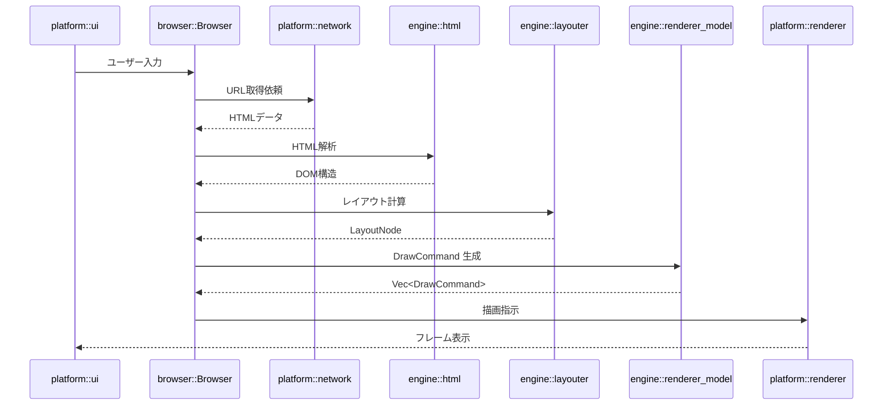

# Orinium Browser Architecture

## 1. 全体構成
```
User Input
   │
   ▼
platform::ui (App)
   │ event
   ▼
browser::Browser
   │ fetch(url)
   ▼
platform::network::NetworkCore
   │ HTML bytes
   ▼
engine::html::parser
   │ DOM Tree
   ▼
engine::layouter
   │ Vec<DrawCommand>
   ▼
platform::renderer
   │ GPU submission
   ▼
Window Frame
```

## 2. 各レイヤの責務
| レイヤ                     | 主なモジュール                                      | 役割                                                       |
|-------------------------|---------------------------------------------|----------------------------------------------------------|
| **Application**         | `main.rs`, `examples/tests.rs`              | エントリポイント、CLI、プロセス管理 (`ProcessHandler`)。         |
| **browser::core**       | `src/browser/core/` {`app`, `tab`, `command`, `ui/`, `webview/`, `resource_loader`} | 全体を統合するオーケストレーション層。アプリ起動、タブ管理、UI 統合。 |
| **engine::html / css**  | `src/engine/html/`・`src/engine/css/`        | トークナイズ、パース、DOM/CSSOM 構築。                          |
| **engine::layouter**    | `src/engine/layouter/` {`builder`, `css_resolver`, `text_layouter`, `types`} | HTML/CSS のレイアウト計算、InfoNode/LayoutNode の生成。       |
| **engine::renderer_model** | `src/engine/renderer_model/` {`draw_command`} | DOM+CSS から `DrawCommand` を生成する論理描画層。              |
| **engine::bridge / input / tree / ui** | `src/engine/bridge/`, `input/`, `tree/`, `ui/` | イベント抽象、入力処理、ツリー構造、UI コンポーネント。               |
| **platform::renderer**  | `src/platform/renderer/` {`gpu`, `glyph/`, `text/`, `image`, `scroll_bar`, `text_measurer`} | GPU 抽象（`wgpu` ベース）。実際の描画実行、フォント・テクスチャ管理。  |
| **platform::network**   | `src/platform/network/`                     | TCP/TLS 通信、HTTP 処理、キャッシュ、Cookie 管理（別プロセス也可能）。 |
| **platform::system**    | `src/platform/system/`                      | OS ウィンドウとイベントループ (`winit`) の管理。                  |
| **platform::io**        | `src/platform/io/`                          | OS 依存の入出力抽象。ファイル・設定管理など。                        |
| **platform::audio**     | `src/platform/audio/`                       | サウンド再生（`cpal` / `symphonia` ベース）。                   |

## 3. 簡単な実行フロー


## 4. 依存方向と逆転依存
* モジュールの依存は **上位 → 下位** の一方向のみ
* 下位層は上位層を参照しない
* 逆転依存は循環依存を生むため避ける
> [!NOTE]
> `engine`層は`platform`層を参照しません

### 依存方向図

```
┌─────────────────────┐
│ browser::core       │
│ (app, tab, command) │
└──────────┬──────────┘
           ▼
┌─────────────────────┐
│ engine              │
│ (html, css, layouter,│
│  renderer_model     │
│  tree, input, ui)   │
└──────────┬──────────┘
           ▼
┌─────────────────────┐
│ platform            │
│ (renderer, network, │
│  system, io, audio) │
└─────────────────────┘
```
* 矢印は依存方向を示す
* 上位層が下位層を呼ぶ一方向のみ
* `engine` は `platform` に依存しません。外部クレートと Rust std のみに依存します。

<!--
イベントは上位層から下位層へ伝播し、下位層に上位を参照させず、必要な場合は Callback / Channel を利用
-->
