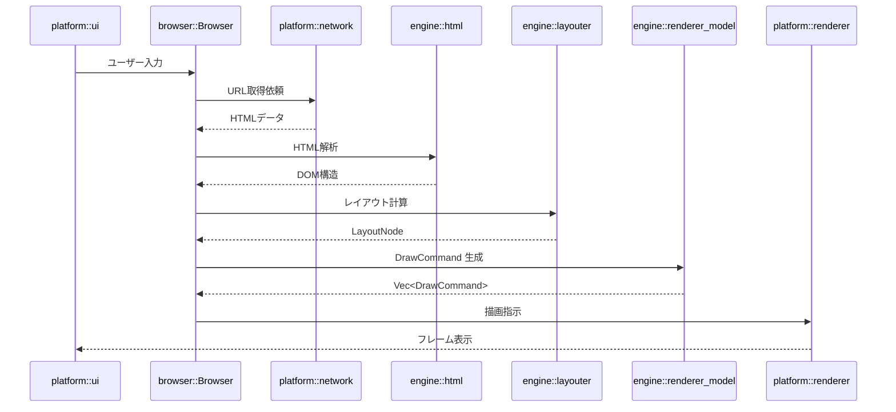

# Orinium Browser Architecture

## 1. 全体構成

```
User Input
   │
   ▼
platform::ui (App)
   │ event
   ▼
browser::Browser
   │ fetch(url)
   ▼
platform::network::NetworkCore
   │ HTML bytes
   ▼
engine::html::parser
   │ DOM Tree
   ▼
engine::layouter
   │ Vec<DrawCommand>
   ▼
platform::renderer
   │ GPU submission
   ▼
Window Frame
```

## 2. 各レイヤの責務

| レイヤ                     | 主なモジュール                                                                              | 役割                                                                                      |
| -------------------------- | ------------------------------------------------------------------------------------------- | ----------------------------------------------------------------------------------------- |
| **Application**            | `main.rs`, `examples/tests.rs`                                                              | エントリポイント、CLI、プロセス管理 (`ProcessHandler`)。                                  |
| **browser::core**          | `src/browser/core/` {`app`, `tab`, `command`, `ui/`, `webview/`, `resource_loader`}         | 全体を統合するオーケストレーション層。アプリ起動、タブ管理、UI 統合。                     |
| **engine::html / css**     | `src/engine/html/`・`src/engine/css/`                                                       | トークナイズ、パース、DOM/CSSOM 構築。                                                    |
| **engine::layouter**       | `src/engine/layouter/` {`builder`, `css_resolver`, `text_layouter`, `types`}                | HTML/CSS のレイアウト計算、InfoNode/LayoutNode の生成。                                   |
| **engine::renderer_model** | `src/engine/renderer_model/` {`draw_command`}                                               | DOM+CSS から `DrawCommand` を生成する論理描画層。                                         |
| **engine::bridge**         | `src/engine/bridge/` {`text`, `audio`}                                                      | engine と platform の境界となる port（trait）定義。text 計測・音声再生の抽象。            |
| **platform::renderer**     | `src/platform/renderer/` {`gpu`, `glyph/`, `text/`, `image`, `scroll_bar`, `text_measurer`} | GPU 抽象（`wgpu` ベース）。実際の描画実行、フォント・テクスチャ管理。                     |
| **platform::network**      | `src/platform/network/`                                                                     | TCP/TLS 通信、HTTP 処理、キャッシュ、Cookie 管理（別プロセス也可能）。                    |
| **platform::system**       | `src/platform/system/` {`app`, `shell`}                                                     | OS ウィンドウとイベントループ (`winit`) の管理。`shell` が `BrowserHost` port。           |
| **platform::io**           | `src/platform/io/`                                                                          | OS 依存の入出力抽象。ファイル・設定管理など。                                             |
| **platform::audio**        | `src/platform/audio/`                                                                       | サウンド再生（`cpal` / `symphonia` ベース）。`PlatformAudioSink` が engine へ実装を提供。 |

## 3. 簡単な実行フロー


```mermaid
sequenceDiagram
    participant UI as platform::ui
    participant Browser as browser::Browser
    participant Net as platform::network
    participant HTML as engine::html
    participant Layout as engine::layouter
    participant Draw as engine::renderer_model
    participant GPU as platform::renderer

    UI->>Browser: ユーザー入力
    Browser->>Net: URL取得依頼
    Net-->>Browser: HTMLデータ
    Browser->>HTML: HTML解析
    HTML-->>Browser: DOM構造
    Browser->>Layout: レイアウト計算
    Layout-->>Browser: LayoutNode
    Browser->>Draw: DrawCommand 生成
    Draw-->>Browser: Vec<DrawCommand>
    Browser->>GPU: 描画指示
    GPU-->>UI: フレーム表示
```

## 4. 依存方向と逆転依存

- モジュールの依存は **上位 → 下位** の一方向のみ
- 下位層は上位層を参照しない
- 逆転依存は循環依存を生むため避ける

> [!NOTE]
> `engine`層は`platform`層を参照しません
> `platform`層も `browser` 層を参照しません

### 依存方向図

```
┌─────────────────────┐
│ browser::core       │
│ (app, tab, command) │
└──────────┬──────────┘
           ▼
┌─────────────────────┐
│ engine              │
│ (html, css, layouter,│
│  renderer_model     │
│  tree, input, ui,   │
│  bridge)            │
└──────────┬──────────┘
           ▼
┌─────────────────────┐
│ platform            │
│ (renderer, network, │
│  system, io, audio) │
└─────────────────────┘
```

- 矢印は依存方向を示す
- 上位層が下位層を呼ぶ一方向のみ
- `engine` は `platform` に依存しません。外部クレートと Rust std のみに依存します。

### 境界には「下位層が所有する型」だけを渡す

上位層から下位層へ何かを渡すとき、その型は下位層が所有中原的东西でなければなりません。
そうでないと、下位層が上位層の内部構造を知る Suite になり、依存が逆転します。

境界 Martian には port（trait）文章的置き、具象実装は下位層に、注入は上位層から行います。

| port                                                    | 定義する層 | 実装する層                | 注入する層                      |
| ------------------------------------------------------- | ---------- | ------------------------- | ------------------------------- |
| `engine::bridge::text::TextMeasurer`                    | engine     | platform                  | browser                         |
| `engine::bridge::audio::AudioSink` / `AudioSinkFactory` | engine     | platform                  | browser（`LayoutTask` 経由）    |
| `platform::system::shell::BrowserHost`                  | platform   | browser                   | browser（`App::new`）           |
| `platform::renderer::draw_sink::DrawSink`               | platform   | platform（`GpuRenderer`） | platform（`WindowState::sink`） |

`platform::system::App` は `BrowserApp` を **所有せず**、`Box<dyn BrowserHost>` を所有します。
ウィンドウの中身を `BrowserUi` として渡す代わりに、window geometry（`WindowGeometry`）だけを渡します。

### 描画は `DrawSink` 越しにだけ届く

browser 層は `DrawCommand` を生成するだけで、**それ-packages を描画するのは sink の役目**です。
`&mut GpuRenderer` をコールチェーンで渡すのではなく、`&mut dyn DrawSink` を渡します。
これにより browser 層は「描画が wgpu の surface 上で行われる」という前提要知道にならず、
`WindowState::sink` を差し替えるだけで offscreen / remote / 記録용 sink に切り替えられます。

`upload`（記録・アップロード）と `present`（描画・提示）が分かれているのは、
提示せずに記録だけを行う sink を作れるようにするためです。

### 機械的な検証

上記ルールは `scripts/check_layering.sh` で検査し、CI でも実行されます。
违反_reference（doc コメントを含む）を検出すると非 0 で終了します。

<!--
イベントは上位層から下位層へ伝播し、下位層に上位を参照させず、必要な場合は Callback / Channel を利用
-->
